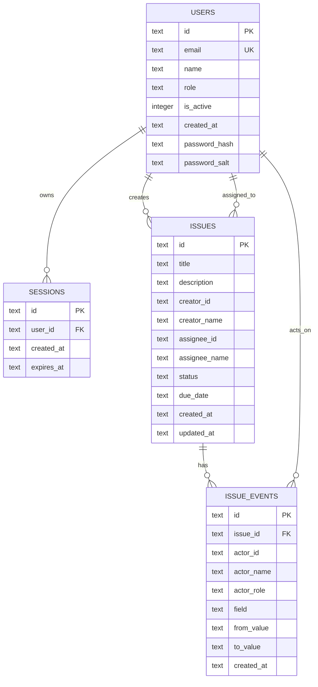
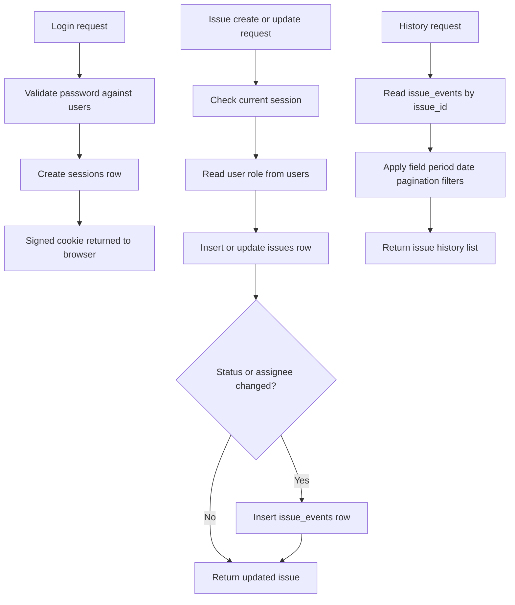

# Simple Issue Management Database Diagram

> Date: 2026-03-19
> Source: current SQLite schema in `src/server/db.ts`

---

## Overview

This document describes the current SQLite database structure used by the project. The schema is centered on users, authenticated sessions, issues, and issue history events.

## ER Diagram

## Table Roles

- `users`: login identity, display name, role, active state, and password hash storage
- `sessions`: server-side session records linked to the signed cookie
- `issues`: main issue records for board and dashboard rendering
- `issue_events`: audit history for status and assignee changes shown in the issue detail dialog

## Data Rules

- `users.role` uses the fixed MVP roles: `lead`, `member`, `planner`
- `issues.status` uses the fixed MVP statuses: `Todo`, `In Progress`, `Done`, `Discarded`
- delayed state is not stored as a column
- delayed state is derived from `due_date < today` and status not in `Done` or `Discarded`
- deleting an issue in the UI is implemented as a soft delete by changing status to `Discarded`

## Logical Data Flow

