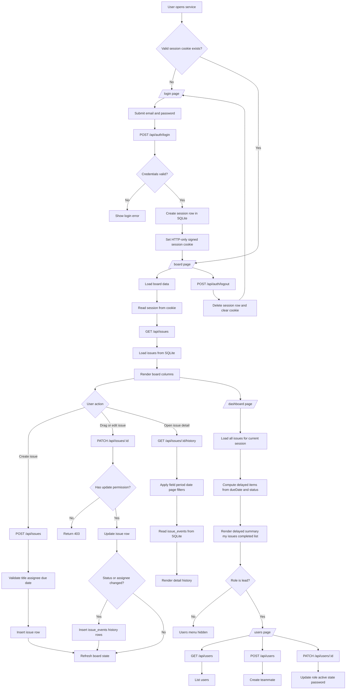

# Simple Issue Management Flow

> Date: 2026-03-19
> Scope: current implemented runtime flow

---

## Overview

This document shows the current end-to-end process flow of the project from first page entry to authenticated work, issue updates, history lookup, and lead-only user management.

## Main Runtime Flow



## Route Responsibility Map

```mermaid
flowchart LR
    UI[Next.js App Router pages] --> API[Route Handlers]
    API --> SERVICE[Server service layer]
    SERVICE --> DB[SQLite database]

    UI --> LOGIN[/login]
    UI --> BOARD[/board]
    UI --> DASH[/dashboard]
    UI --> USERS[/users lead only]

    API --> AUTHAPI[/api/auth/login me logout]
    API --> ISSUEAPI[/api/issues and /api/issues/:id]
    API --> HISTORYAPI[/api/issues/:id/history]
    API --> USERAPI[/api/users and /api/users/:id]

    SERVICE --> AUTHSVC[auth.ts session.ts]
    SERVICE --> ISSUESVC[issues.ts]
    SERVICE --> USERSVC[users.ts]

    DB --> USERSDB[(users)]
    DB --> SESSIONSDB[(sessions)]
    DB --> ISSUESDB[(issues)]
    DB --> EVENTSDB[(issue_events)]
```

## Notes

- The root `/` route immediately redirects to `/board` or `/login` based on the session.
- `planner` users can view data but cannot update or discard issues.
- `member` users can update issues only when they are the creator or assignee.
- `lead` users can access the `/users` screen and manage teammates.
